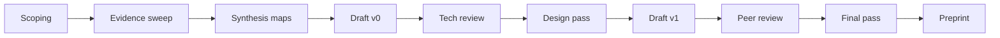

# Дорожня карта дослідницької публікації «Легенда Ci»

## Метадані проєкту

**Назва**: Легенда Ci: Універсальність дуального принципу у світобудові  
**Тип**: Науково-дослідницька праця з художнім оформленням  
**Обсяг**: 20 сторінок (базова версія) + можливість масштабування  
**Формат**: PDF/EPUB з ілюстраціями, схемами та візуалізаціями  
**Мови**: Українська (primary), English (secondary)  
**Статус**: 🟡 В розробці  

---

## A. Маніфест і дослідницька теза

### Центральна теза
**Дуальний принцип є універсальною структурою прояву** — від квантових станів до людських практик — і виражається як **Ci: активація сенсу, що поєднує намір і форму**.

### Доказова стратегія
Міждисциплінарна синтеза через:
- 🔬 **Фізика**: квантова дуальність, симетрії, античастинки
- 🧬 **Біологія**: білатеральна симетрія, циркадні ритми, клітинні осциляції
- 🧠 **Когнітивні науки**: латералізація мозку, бінокулярний зір, інтеграція
- 📚 **Історія ідей**: міфи, символи, філософські системи
- 🔢 **Математика**: пропорції, симетрії, топологія
- 🎨 **Культурологія**: символічні системи, практики

### Критерії якості
✅ Коректність термінів  
✅ Перевірність тверджень  
✅ Видимий зв'язок: **ідея → приклад → наслідок**  
✅ Візуальна наочність  
✅ Практична застосовність  

---

## B. Аудиторії та цінність

### Основна аудиторія
- 🧠 Мислителі та філософи
- 🎨 Дизайнери смислових систем
- 📖 Освітяни та викладачі
- 💡 Продуктові візіонери
- 🔬 Міждисциплінарні дослідники

### Другорядна аудиторія
- 🎓 Студенти (природничі та гуманітарні науки)
- 📚 Науково-популярна аудиторія
- 🌐 Громадськість, зацікавлена в системному мисленні

### Цінність для читача
✨ **Ясні моделі** для розуміння складних систем  
📊 **Візуальні схеми** для наочності  
🎯 **Практичні приклади** застосування (щоденні ритми, командні процеси, дизайн рішень)  
🔗 **Інтеграційний підхід** між наукою, мистецтвом і практикою  

---

## C. Архітектура видання

### Структура розділів

Кожен розділ містить:
- **RQ** (Research Question) — дослідницьке питання
- **Факти сьогодення** — перевірені дані
- **Приклад** — конкретний кейс
- **Ілюстрація** — візуалізація (FIG-XX)
- **Висновок** — синтез
- **DoD** (Definition of Done) — критерії завершеності

---

### 1️⃣ Початок у тиші

**RQ**: Як «порожнеча потенціалу» переходить у ритм?

**Факти сьогодення**:
- Квантові флуктуації вакууму
- Принцип мінімальної дії в фізиці
- Коливальні процеси як базова форма динаміки

**Приклад**:
- Народження віртуальних частинок у вакуумі
- Перехід від спокою до руху в механічних системах

**Ілюстрація**: FIG-01  
Абстрактна карта поля потенціалу (Wuji) → хвиля активації

**DoD**:
- [ ] 2 перевірені наукові посилання
- [ ] 1 схема поля потенціалу
- [ ] Коректне використання термінів квантової механіки

---

### 2️⃣ Пульс і подих

**RQ**: Як ритми формують структуру часу в живих системах?

**Факти сьогодення**:
- Циркадні ритми (24-годинний цикл)
- Серцеві ритми (60-100 уд/хв)
- Клітинні осциляції (секундні-хвилинні)
- Альфа-ритми мозку (8-13 Гц)

**Приклади «сьогодні»**:
1. Порушення циркадних ритмів → джетлаг, нічні зміни
2. Pomodoro Technique (25/5 хв) — робочі спринти
3. Дихальні вправи (4-7-8) для регуляції стану

**Ілюстрація**: FIG-02  
Спектр частот і ритмів від секунд до діб

**DoD**:
- [ ] 3 приклади «сьогодні» з джерелами
- [ ] Графік спектру частот
- [ ] Посилання на дослідження циркадних ритмів

---

### 3️⃣ Розщеплення і симетрія

**RQ**: Чому симетрія та її порушення є базою структур?

**Факти сьогодення**:
- Симетрії в фізиці елементарних частинок
- Теорема Нетер: симетрія ↔ закон збереження
- Спонтанне порушення симетрії (механізм Хіггса)
- P-порушення (паритет) у слабких взаємодіях

**Приклад**:
- Хіральність молекул (L- і D-форми амінокислот)
- Життя використовує лише L-амінокислоти
- Біохімічна асиметрія як умова життя

**Ілюстрація**: FIG-03  
Дзеркальна пара молекул + схема порушення симетрії

**DoD**:
- [ ] Терміни узгоджені з глосарієм
- [ ] Приклад хіральності з біохімії
- [ ] Візуалізація дзеркальної симетрії

---

### 4️⃣ Відображення в матерії

**RQ**: Як дуальність проявляється на рівні елементарних частинок?

**Факти сьогодення**:
- Електричні заряди: + і −
- Спіни: ↑ і ↓
- Корпускулярно-хвильовий дуалізм
- Частинка/античастинка (e⁻/e⁺, p/p̄)
- Анігіляція при зустрічі

**Приклад**:
- Позитронно-емісійна томографія (ПЕТ-скан)
- Використання античастинок у медицині

**Ілюстрація**: FIG-04  
Діаграма: частинка ↔ античастинка, хвиля ↔ частинка

**DoD**:
- [ ] 2 сучасні підручники з фізики частинок
- [ ] 1 популярне джерело (напр., Scientific American)
- [ ] Коректна термінологія квантової механіки

---

### 5️⃣ Людське тіло як карта дуальності

**RQ**: Як білатеральна симетрія проявляється у функціях організму?

**Факти сьогодення**:
- Білатеральна симетрія тіла (ліво/право)
- Латералізація функцій мозку
- Бінокулярний зір → глибина сприйняття
- Бінауральний слух → локалізація звуку
- Двоколовий кровообіг (велике/мале коло)

**Приклад**:
- Стереозір у хірургів і пілотів
- Музиканти: міжпівкульна координація
- Амбідекстрія та навчання

**Ілюстрація**: FIG-05  
Фронтальна схема тіла з позначенням парних органів і функцій

**DoD**:
- [ ] Уникнути нейроміфів (типу "ліво=логіка, право=творчість")
- [ ] Збалансоване наукове пояснення латералізації
- [ ] Приклади з нейронауки

---

### 6️⃣ Математика відносин

**RQ**: Як математичні співвідношення визначають гармонію?

**Факти сьогодення**:
- Золотий перетин (φ ≈ 1.618)
- Послідовність Фібоначчі в природі
- Музичні інтервали (октава 2:1, квінта 3:2)
- Композиційні пропорції у дизайні

**Приклади з сучасного дизайну**:
- Модульні сітки в UI/UX (8pt grid)
- Типографічні шкали
- Архітектурні пропорції

**Ілюстрація**: FIG-06  
Модульна сітка + золотий перетин + приклади застосування

**DoD**:
- [ ] Приклади з сучасного digital design
- [ ] Математичні формули золотого перетину
- [ ] Візуалізація пропорцій

---

### 7️⃣ Природні прояви

**RQ**: Як дуальні цикли організовують природні процеси?

**Факти сьогодення**:
- Припливи/відпливи (гравітація Місяця)
- Сезони (нахил осі Землі)
- Екологічні рівноваги (хижак/жертва)
- Фотосинтез/дихання (O₂ ↔ CO₂)

**Локальний приклад**:
- Сезонні зміни в Україні
- Міграції птахів
- Сільськогосподарські цикли

**Ілюстрація**: FIG-07  
Календар-кільце природних циклів (рік, місяць, доба)

**DoD**:
- [ ] Один локальний кейс (українська природа)
- [ ] Візуалізація річного циклу
- [ ] Приклади екологічних балансів

---

### 8️⃣ Дуальність у знаннях

**RQ**: Як поєднуються емпіричні та інтуїтивні шляхи пізнання?

**Факти сьогодення**:
- Методи переживання (феноменологія, споглядання)
- Методи перевірки (експеримент, верифікація)
- Contemplative neuroscience (медитація + fMRI)
- Біофідбек і нейрофідбек

**Приклад**:
- Медитація осуслівленості + вимірювання кортизолу
- Гіпотеза → експериментальна перевірка
- Якісні та кількісні методи в дослідженнях

**Ілюстрація**: FIG-08  
Міст між підходами: "переживання ↔ перевірка"

**DoD**:
- [ ] Чітка карта меж кожного методу
- [ ] Приклади синтезу (contemplative science)
- [ ] Уникнення редукціонізму

---

### 9️⃣ Символи як мости

**RQ**: Як універсальні форми кодують смисли?

**Факти сьогодення**:
- Семіотика базових форм
- Архетипи К.Г. Юнга
- Культурна семіотика

**Таблиця символів**:
| Символ | Значення | Приклади |
|--------|----------|----------|
| ⭕ Коло | Нескінченність, цілісність | Уроборос, мандала |
| ✚ Хрест | Рівновага, перетин | Координати, компас |
| 🌀 Спіраль | Розвиток, еволюція | Галактики, ДНК |
| ∞ Восьмерик | Безперервність, цикл | Лемніската |
| △ Трикутник | Баланс, трійця | Піраміда |
| ▢ Квадрат | Стабільність | Основа |
| ☯ Інь-Ян | Дуальність | Протилежності |
| ✡ Гексаграма | Поєднання | Макро/мікро |

**Ілюстрація**: FIG-09  
Візуальна таблиця символів з поясненнями

**DoD**:
- [ ] 8 коротких нотаток по символах
- [ ] Культурні контексти
- [ ] Сучасні застосування

---

### 🔟 Мережа зв'язків

**RQ**: Як емерджентність виникає з мережевих структур?

**Факти сьогодення**:
- Теорія графів і складні мережі
- Small-world networks (Watts & Strogatz)
- Scale-free networks (Barabási)
- Емерджентність у складних системах

**Кейс**: Як зміна в одному вузлі розтікається мережею
- Соціальні мережі: вірусний контент
- Нервова система: каскади активації
- Екосистеми: трофічні каскади

**Ілюстрація**: FIG-10  
**Cimeika Sense Network (SVG)** — готово

**DoD**:
- [ ] 1 детальний кейс розповсюдження
- [ ] Математичні основи (граф, ступінь вершини)
- [ ] Візуалізація мережі

---

### 1️⃣1️⃣ Cimeika — сенсова проекція свідомого вибору

**RQ**: Як намір трансформується в дію через контекст?

**Факти сьогодення**:
- Намір і увага (cognitive control)
- Контекст-залежні ефекти
- Embodied cognition
- Agency і волевиявлення

**Сценарій застосування** (user journey):
1. **Намір**: Користувач формує запит/бажання
2. **Контекст**: Система розпізнає ситуацію
3. **Активація**: Ci координує модулі
4. **Подія**: Відбувається дія
5. **Наслідок**: Результат інтегрується в пам'ять

**Ілюстрація**: FIG-11  
Воронка "намір → активація → подія → наслідок"

**DoD**:
- [ ] Один повний user journey
- [ ] Зв'язок з когнітивними науками
- [ ] Практичний кейс

---

### 1️⃣2️⃣ Символіка і математика алхімії

**RQ**: Як метафори трансформації співвідносяться з реальними процесами?

**Факти сьогодення**:
- Історичні алхімічні символи
- Сучасна інтерпретація як метафор
- Психологічна алхімія (Юнг)

**Алхімічна матриця**:
| Елемент | Символ | Якості | Сучасна метафора |
|---------|--------|--------|------------------|
| 🜃 Земля | ▽ | Стабільність | Структура даних |
| 🜄 Вода | ▽ з рискою | Плинність | Потік процесів |
| 🜁 Повітря | △ з рискою | Рухливість | Комунікація |
| 🜂 Вогонь | △ | Трансформація | Обчислення |
| ⟁ Ефір | Коло з точкою | Зв'язок | Мережа |

**Ілюстрація**: FIG-12  
Матриця "елемент ↔ процес" з маркуванням рівнів

**DoD**:
- [ ] Чітке розмежування метафори vs фізика
- [ ] Маркування рівнів: 🔬 факт / 🧭 модель / 🎨 метафора
- [ ] Історичний контекст

---

### 1️⃣3️⃣ Все, чого немає — сесія варіантів

**RQ**: Як генеративне мислення створює можливості?

**Факти сьогодення**:
- Сценарне планування (Scenario planning)
- Design thinking і дивергентна фаза
- Квантова суперпозиція як метафора

**3 життєві сценарії**:
1. **Особистий**: Вибір кар'єри (варіанти A/B/C)
2. **Командний**: Стратегія продукту (сценарії розвитку)
3. **Соціальний**: Урбаністичне планування (альтернативи)

**Ілюстрація**: FIG-13  
Дерево рішень з наслідками

**DoD**:
- [ ] 3 детальні сценарії
- [ ] Візуалізація дерева варіантів
- [ ] Методологія генерації варіантів

---

### 1️⃣4️⃣ Прояв сенсу буття: Ci

**RQ**: Як синхронізація наміру і дії створює сенсові вузли?

**Факти сьогодення**:
- Причинно-наслідкові петлі (feedback loops)
- Синхронізація в складних системах
- Колективна координація

**Кейси**:
1. **Особистий**: Щоденна практика (медитація → усвідомленість → рішення)
2. **Соціальний**: Громадська ініціатива (намір → організація → зміна)

**Ілюстрація**: FIG-14  
Діаграма потоків: вузлові перетини сенсів

**DoD**:
- [ ] 1 особистий кейс
- [ ] 1 соціальний кейс
- [ ] Візуалізація потоків і вузлів

---

### 1️⃣5️⃣ Вічний потік

**RQ**: Як цикли і рекурсія підтримують безперервність?

**Факти сьогодення**:
- Рекурсивні структури в природі
- Фрактальна геометрія
- "Кінець як початок" у циклічних процесах

**Узагальнююча теза**:
Дуальність → динамічна рівновага → емерджентність → нові дуальності

**Карта подальших досліджень**:
- Тріадичні структури (наступний рівень складності)
- Голографічний принцип
- Системна теорія інтеграції

**Ілюстрація**: FIG-15  
Лемніската ♾ з фазами циклу

**DoD**:
- [ ] Узагальнююча теза
- [ ] 3-5 напрямків подальших досліджень
- [ ] Візуалізація нескінченного циклу

---

## D. Методологія і валідність

### Огляд літератури

**Первинні джерела**:
- Підручники з фізики, біології, когнітивних наук
- Рецензовані статті (peer-reviewed journals)
- Класичні філософські тексти

**Науково-популярні огляди**:
- Scientific American, Nature News, Quanta Magazine
- TED Talks та публічні лекції

### Факт-чек протокол

✅ **Терміни**: Перевірка дефініцій через глосарій  
✅ **Дати**: Історична точність  
✅ **Одиниці**: Коректні фізичні величини  
✅ **Уникання спрощень**: "Ліва/права півкуля" → латералізація з нюансами  

### Синтез

**Концептуальні карти**:
```
Ідея → Механізм → Приклад → Наслідок
  ↓
Візуалізація
```

### Етика

- Культурна чутливість при інтерпретації символів
- Коректне цитування джерел
- Уникнення редукціонізму
- Визнання обмежень моделей

---

## E. План ілюстрацій

| ID | Назва | Тип | Статус |
|----|-------|-----|--------|
| FIG-01 | Поле потенціалу → хвиля активації | Абстрактна діаграма | 🔴 TODO |
| FIG-02 | Спектр ритмів | Графік частот | 🔴 TODO |
| FIG-03 | Дзеркальна симетрія | Схема молекул | 🔴 TODO |
| FIG-04 | Частинка/античастинка | Діаграма Фейнмана | 🔴 TODO |
| FIG-05 | Людське тіло: симетрія | Анатомічна схема | 🔴 TODO |
| FIG-06 | Золотий перетин | Геометрична побудова | 🔴 TODO |
| FIG-07 | Календар-кільце | Річний цикл | 🔴 TODO |
| FIG-08 | Міст переживання↔перевірка | Концептуальна схема | 🔴 TODO |
| FIG-09 | Таблиця символів | Інфографіка | 🔴 TODO |
| FIG-10 | Cimeika Sense Network | Мережева діаграма | 🟢 DONE |
| FIG-11 | Воронка наміру | Процесна схема | 🔴 TODO |
| FIG-12 | Алхімічна матриця | Таблиця | 🔴 TODO |
| FIG-13 | Дерево варіантів | Граф рішень | 🔴 TODO |
| FIG-14 | Вузлові перетини | Діаграма потоків | 🔴 TODO |
| FIG-15 | Лемніската циклів | Символічна схема | 🔴 TODO |

---

## F. Конвеєр створення

### Етапи роботи



### 1. Scoping (Тиждень 1)
- [ ] Зафіксувати центральну тезу
- [ ] Визначити обсяг (20 сторінок)
- [ ] Профілі аудиторій
- [ ] Створити RACI матрицю

### 2. Evidence sweep (Тиждень 2-3)
- [ ] Зібрати 5-7 ключових джерел на розділ
- [ ] Створити бібліографію в Zotero
- [ ] Факт-чек ключових тверджень

### 3. Synthesis maps (Тиждень 4)
- [ ] Намалювати картки "ідея-факт-візуал" для кожного розділу
- [ ] Miro/Figma дошка зі зв'язками

### 4. Draft v0 (Тиждень 5-8)
- [ ] Чорновик тексту всіх розділів
- [ ] Плейсхолдери фігур з описом
- [ ] Перша внутрішня перевірка

### 5. Tech review (Тиждень 9)
- [ ] Перевірка фактів експертами
- [ ] Затвердження глосарію
- [ ] Уточнення термінології

### 6. Design pass (Тиждень 10-11)
- [ ] Уніфікація стилів ілюстрацій
- [ ] Колірна палітра Ci
- [ ] Підписи до фігур

### 7. Draft v1 (Тиждень 12)
- [ ] Повний текст + 80% ілюстрацій
- [ ] Внутрішня перевірка DoD

### 8. Peer review (Тиждень 13)
- [ ] Зовнішнє читання (3-5 рецензентів)
- [ ] Збір зауважень
- [ ] Планування виправлень

### 9. Final pass (Тиждень 14)
- [ ] Внесення правок
- [ ] Шліфування мови
- [ ] Фінальна вичитка

### 10. Preprint (Тиждень 15)
- [ ] Верстка PDF/EPUB
- [ ] Метадані
- [ ] Реєстрація DOI (за потреби)
- [ ] Публікація

---

## G. Стандарти оформлення

### Стиль тексту
- **Темп**: Спокійний, медитативний у ключових місцях
- **Художні акценти**: Використання метафор та образів
- **Чіткість термінів**: Глосарій на початку або в кінці
- **Мова**: Українська (primary) з можливим англійським перекладом

### Посилання
- **Стиль**: APA 7th edition (психологія, когнітивні науки) або Chicago (гуманітарні)
- **Розміщення**: Виноски внизу сторінки або список в кінці
- **Мінімум**: 3 посилання на розділ (1-2 наукові + 1 популярне)

### Графіка
- **Формат**: Векторна графіка (SVG preferred)
- **Сітка**: 8pt базова сітка для вирівнювання
- **Шрифти**: Sans-serif для діаграм (Ubuntu, Inter, Roboto)
- **Палітра**: Узгоджена з брендом Ci

### Маркування рівнів
- 🔬 **Факт**: Емпірично перевірені дані
- 🧭 **Модель**: Теоретичні конструкти
- 🎨 **Метафора**: Художні образи

---

## H. Матриця відповідальностей (RACI)

| Роль | Діяльність | RACI |
|------|------------|------|
| Автор-дослідник | Написання розділів | R |
| Редактор/Візіонер | Загальна концепція | A |
| Експерт-фізик | Консультація з фізики | C |
| Експерт-нейробіолог | Консультація з нейронауки | C |
| Дизайнер | Ілюстрації та верстка | R |
| Координатор проєкту | Таймлайн та DoD | A |
| Рецензенти | Peer review | C |
| Комьюніті | Фідбек | I |

**Легенда**:
- R = Responsible (Виконавець)
- A = Accountable (Відповідальний)
- C = Consulted (Консультант)
- I = Informed (Інформований)

---

## I. Definition of Done (загальний)

### Критерії завершеності публікації

✅ **Текст**:
- [ ] Логіка "ідея → факт → приклад → висновок" витримана в кожному розділі
- [ ] Всі терміни з глосарію використані коректно
- [ ] Читабельність: Flesch Reading Ease > 50

✅ **Візуали**:
- [ ] Мінімум 1 фігура на розділ (15 фігур total)
- [ ] Кожна фігура має підпис і джерело
- [ ] Єдиний візуальний стиль

✅ **Посилання**:
- [ ] ≥3 посилання на розділ (45+ total)
- [ ] 1-2 рецензовані/підручники + 1 популярне
- [ ] Бібліографія оформлена в APA/Chicago

✅ **Глосарій**:
- [ ] 30-50 термінів з визначеннями
- [ ] Посилання на першу згадку в тексті

✅ **Факт-чек**:
- [ ] Всі наукові твердження перевірені
- [ ] Уникнені нейроміфи та редукціонізм
- [ ] Маркування рівнів (🔬/🧭/🎨) присутнє

✅ **Публікація**:
- [ ] PDF версія (готова до друку)
- [ ] EPUB версія (для е-рідерів)
- [ ] HTML версія (веб-доступ)
- [ ] Метадані (автор, анотація, ключові слова)

---

## J. Зразок наповнення

### Розділ 5: Людське тіло як карта дуальності (детально)

#### Ідея
Тіло людини — це фізичне втілення принципу дуальності: двобічно симетричне за структурою, але з функціональними асиметріями, що створюють переваги.

#### Факти

**Білатеральна симетрія**:
- Ліва і права половини тіла майже дзеркальні
- Парні органи: очі, вуха, легені, нирки
- Кінцівки: руки і ноги

**Бінокулярний зір**:
- Два ока → стереоскопічний зір
- Оцінка глибини через паралакс
- Поле зору ~200° (кожне око ~150°, перекриття ~100°)

**Бінауральний слух**:
- Два вуха → локалізація звуку
- Інтерауральна різниця часу (ITD)
- Інтерауральна різниця інтенсивності (IID)

**Латералізація мозку** (з обережністю):
- Мовні функції: часто ліва півкуля (95% праворуких, 70% ліворуких)
- Візуально-просторові: часто права півкуля
- **Важливо**: Варіативність висока, міжпівкульна співпраця критична

**Двоколовий кровообіг**:
- Велике коло: серце → тіло → серце
- Мале коло: серце → легені → серце

#### Приклади

**1. Просторове сприйняття у професіях**:
- **Пілоти**: Стереозір для посадки
- **Хірурги**: Глибина сприйняття в операціях
- **Архітектори**: Просторове мислення при проєктуванні

**2. Музиканти і міжпівкульна координація**:
- Гра на інструменті: координація обох рук
- Читання нот + виконання = інтеграція функцій
- Дослідження: збільшення мозолистого тіла у музикантів

**3. Амбідекстрія**:
- Навчання використовувати обидві руки
- Нейропластичність мозку
- Приклад: Леонардо да Вінчі (писав обома руками)

#### Ілюстрація: FIG-05

```
[Фронтальна схема тіла]
         
    👁️     👁️  ← Бінокулярний зір
     👂   👂   ← Бінауральний слух
    
   🫀 Серце (двокамерне)
   
  🫁 🫁 Легені (парні)
  
  💪  💪 Руки
  
   🦵 🦵 Ноги
   
Підписи:
- Парні органи виділені
- Латералізація функцій показана стрілками
- Кровообіг: велике/мале коло
```

#### Висновок
Дуальність структури людського тіла не є випадковою — вона створює **перевагу інтеграції** над "однопівкульністю" чи односторонністю. Два ока бачать більше, два вуха чують точніше, дві півкулі мислять повніше. Найефективнішим є не домінування одного боку, а **гармонійна співпраця двох**.

#### DoD Checklist
- [x] Уникнуто нейроміфів ("ліва=логіка")
- [x] Збалансоване пояснення латералізації
- [x] 3 конкретні приклади з життя
- [x] Ілюстрація зі схемою тіла
- [x] Посилання на нейробіологічні дослідження

---

## K. Ризики й запобіжники

### Виявлені ризики

| Ризик | Ймовірність | Вплив | Запобіжник |
|-------|-------------|-------|------------|
| **Нейроміфи** (напр., "10% мозку") | 🟡 Середня | 🔴 Високий | Факт-чек з нейробіологом |
| **Надмірні узагальнення символів** | 🟡 Середня | 🟡 Середній | Культурна контекстуалізація |
| **Плутанина метафори з фізикою** | 🟢 Низька | 🟡 Середній | Маркування рівнів 🔬/🧭/🎨 |
| **Псевдонаука** | 🟢 Низька | 🔴 Високий | Подвійний факт-чек, peer review |
| **Редукціонізм** | 🟡 Середня | 🟡 Середній | Визнання складності, обмежень моделей |
| **Затримка графіки** | 🟡 Середня | 🟡 Середній | Ранній старт дизайну, плейсхолдери |

### Стратегії мітигації

**1. Нейроміфи → Expert review**
- Консультація з нейробіологом на етапі Tech review
- Використання актуальних джерел (< 5 років)

**2. Символьні узагальнення → Контекст**
- Вказувати культурне походження символу
- Уникати тверджень про "універсальність"

**3. Метафора/фізика → Маркування**
- Чітке позначення: 🔬 факт / 🧭 модель / 🎨 метафора
- Не змішувати рівні в одному абзаці

**4. Псевдонаука → Подвійна перевірка**
- Первинна перевірка автором
- Факт-чек від незалежного експерта
- Peer review перед публікацією

**5. Редукціонізм → Складність**
- Визнавати обмеження моделей
- "Модель X корисна для..., але не враховує..."

---

## L. Публікація і поширення

### Формати видання

**1. PDF (Primary)**
- Формат: A4 або US Letter
- Розширення: Printable
- Розміщення: Open repository (Zenodo, OSF)

**2. EPUB (Secondary)**
- Рефлоу-текст для е-рідерів
- Підтримка SVG ілюстрацій
- Доступність: WCAG 2.1 AA

**3. HTML (Web)**
- Респонсивний дизайн
- Інтерактивні візуалізації (D3.js)
- Розміщення: docs.cimeika.com/legend

### Метадані

```yaml
title: "Легенда Ci: Універсальність дуального принципу у світобудові"
subtitle: "Міждисциплінарне дослідження"
author: 
  - name: "[Ім'я автора]"
    affiliation: "Cimeika Research"
    orcid: "0000-0000-0000-0000"
language: uk
keywords:
  - дуальність
  - симетрія
  - міждисциплінарність
  - Ci
  - Cimeika
  - філософія науки
abstract: |
  Дослідження універсальності дуального принципу як структури прояву
  від квантових станів до людських практик. Синтеза фізики, біології,
  когнітивних наук, математики та культурології.
date: "2024-XX-XX"
version: "1.0"
doi: "10.XXXX/XXXXX"
license: "CC BY-SA 4.0"
```

### Канали поширення

**1. Відкриті репозиторії**
- [ ] Zenodo (DOI присвоєння)
- [ ] Open Science Framework (OSF)
- [ ] ResearchGate
- [ ] Academia.edu

**2. Освітні платформи**
- [ ] Coursera / EdX (якщо курс)
- [ ] YouTube (відео-супровід)
- [ ] Medium (адаптовані розділи)

**3. Презентації**
- [ ] Конференції (філософія науки, когнітивні науки)
- [ ] Воркшопи та семінари
- [ ] Вебінари

**4. Соціальні медіа**
- [ ] Twitter threads (ключові ідеї)
- [ ] LinkedIn articles (професійна аудиторія)
- [ ] Instagram (візуальні елементи)

**5. Преса**
- [ ] Науково-популярні видання (Квант, Популярна механіка)
- [ ] Інтерв'ю подкастам
- [ ] Блог-пости

### Ліцензування

**Рекомендована ліцензія**: [CC BY-SA 4.0](https://creativecommons.org/licenses/by-sa/4.0/)

**Дозволяє**:
- ✅ Копіювання та розповсюдження
- ✅ Адаптація та ремікс
- ✅ Комерційне використання

**Вимагає**:
- 📝 Зазначення авторства
- 🔄 Поширення похідних робіт під тією самою ліцензією

---

## M. Таймлайн проєкту

```
Тиждень 1-2:   ████░░░░░░░░░░░░ Scoping + Evidence sweep
Тиждень 3-4:   ░░░░████░░░░░░░░ Synthesis maps
Тиждень 5-8:   ░░░░░░░░████████ Draft v0 (всі розділи)
Тиждень 9:     ░░░░░░░░░░░░██░░ Tech review
Тиждень 10-11: ░░░░░░░░░░░░░░██ Design pass (ілюстрації)
Тиждень 12:    ░░░░░░░░░░░░░░░█ Draft v1 (80% готовий)
Тиждень 13:    ░░░░░░░░░░░░░░░█ Peer review
Тиждень 14:    ░░░░░░░░░░░░░░░█ Final pass
Тиждень 15:    ░░░░░░░░░░░░░░░█ Preprint & публікація

Загальна тривалість: ~4 місяці
```

---

## N. Додаткові ресурси

### Бібліографічні менеджери
- **Zotero** (безкоштовний, open-source)
- **Mendeley** (безкоштовний)
- **EndNote** (платний)

### Інструменти візуалізації
- **Figma** — дизайн ілюстрацій
- **Adobe Illustrator** — векторна графіка
- **D3.js** — інтерактивні візуалізації
- **Miro** — концептуальні карти

### Платформи співпраці
- **GitHub** — версіонування тексту
- **Overleaf** — LaTeX для академічного оформлення
- **Google Docs** — спільне редагування

### Факт-чек ресурси
- **Google Scholar** — наукові статті
- **PubMed** — біомедицина
- **arXiv** — фізика, математика
- **Stanford Encyclopedia of Philosophy** — філософія

---

## O. Контакти та підтримка

**Проєкт**: Легенда Ci  
**Організація**: Cimeika Research  
**Email**: research@cimeika.com (приклад)  
**Веб**: https://cimeika.com/legend  
**GitHub**: https://github.com/Ihorog/cimeika-unified  

**Для питань та пропозицій**:
- Відкрийте Issue на GitHub
- Надішліть email на research@cimeika.com
- Приєднуйтесь до обговорення в [Спільноті]

---

## P. Чеклист запуску проєкту

### Перед стартом

- [ ] Сформувати команду (автор, редактор, дизайнер, рецензенти)
- [ ] Створити RACI матрицю
- [ ] Налаштувати інструменти (Zotero, Figma, GitHub)
- [ ] Створити проєктну дошку (Trello/Asana/Notion)
- [ ] Затвердити центральну тезу
- [ ] Визначити обсяг (20 сторінок)

### Під час роботи

- [ ] Щотижневі синхронізації команди
- [ ] Відстеження прогресу через DoD
- [ ] Регулярний факт-чек
- [ ] Збір зауважень рецензентів

### Перед публікацією

- [ ] Повний DoD checklist пройдений
- [ ] Peer review завершений
- [ ] Метадані підготовлені
- [ ] DOI зареєстрований (якщо потрібно)
- [ ] Канали поширення готові

---

**Статус документу**: 🟢 Затверджено  
**Версія**: 1.0  
**Дата**: 2024-12-22  
**Автор roadmap**: Cimeika Research Team  
**Ліцензія**: CC BY-SA 4.0  

---

_Цей roadmap є живим документом і може оновлюватися в процесі роботи над публікацією._
